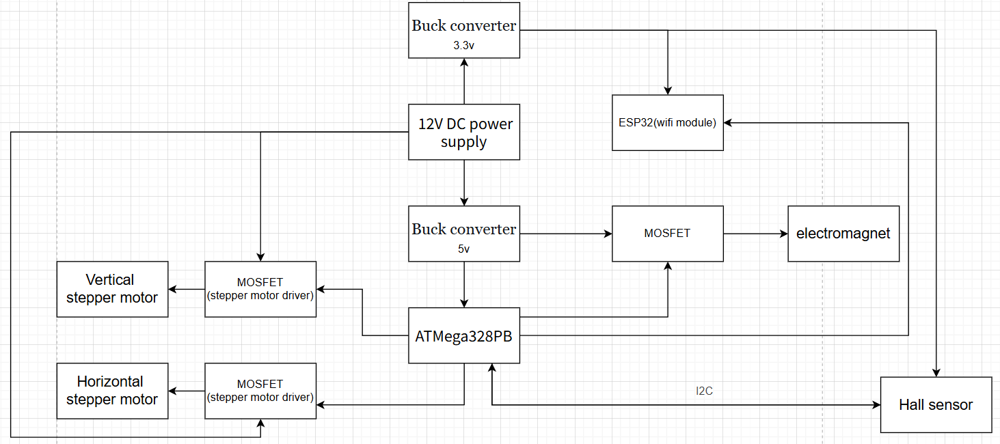
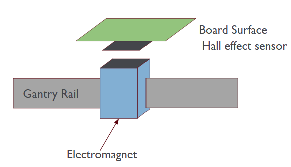
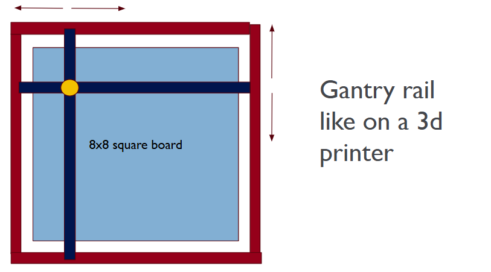
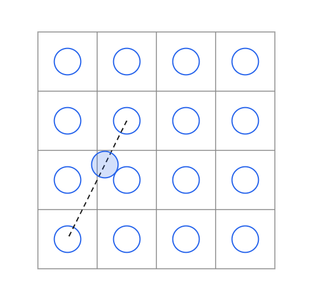
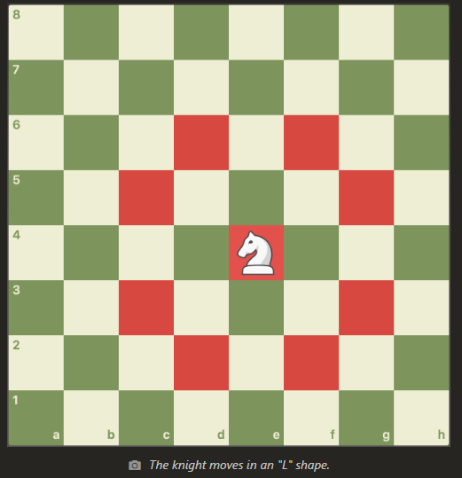
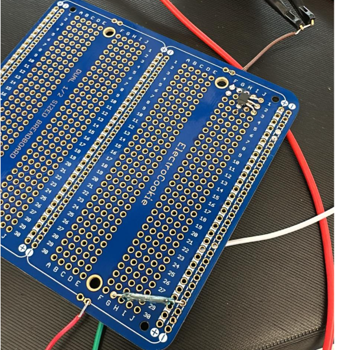
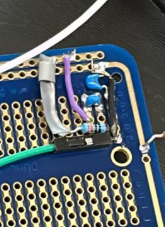
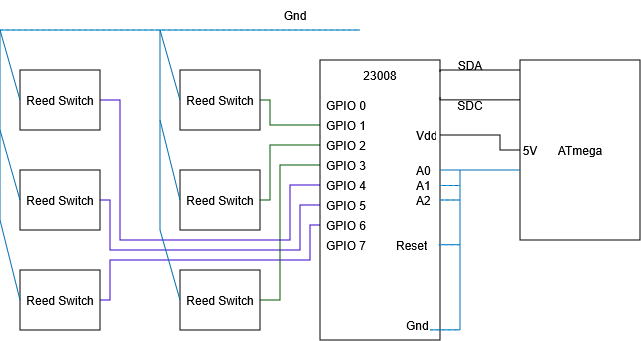
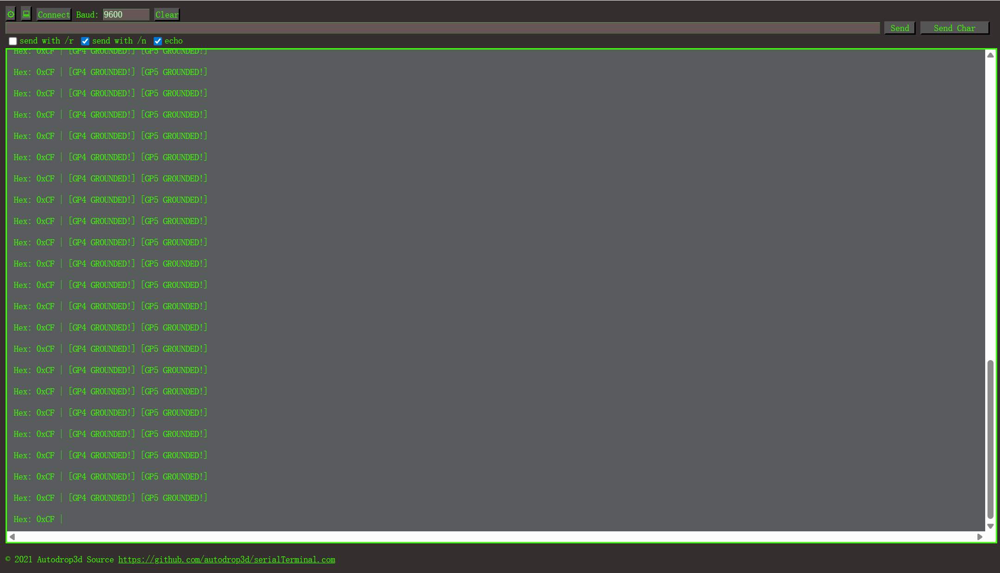
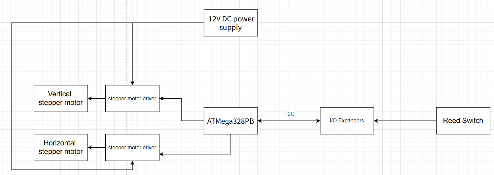

[](https://classroom.github.com/a/a-5mB3GB)

# final-project-skeleton

**Team Number: 24**

**Team Name: TEAM |= (1<<TEAM_NAME)**

| Team Member Name | Email Address          |
| ---------------- | ---------------------- |
| Bowen Wang       | wangbw@seas.upenn.edu  |
| Alexander Yu     | ayu2126@seas.upenn.edu |
| Benjamin Abt     | bencabt@seas.upenn.edu |

**GitHub Repository URL: [https://github.com/upenn-embedded/final-project-f25-f25-final_project-t24.git](https://github.com/upenn-embedded/final-project-f25-f25-final_project-t24.git)**

**GitHub Pages Website URL:** [for final submission]\*

## Final Project Proposal

### 1. Abstract

We aim to build a pair of chess boards with chess pieces that can communicate moves made by one human player to the other board and have the other board move the piece. The boards will achieve this by using hall effect sensor arrays under the board surface to detect moves made human players, send the move to the paired board, and that board will use a gantry rail system to actualize the move. This way, two human players play physical chess against each other in potentially two separate rooms.

An additional feature would be that the player could change a setting and play against a computer on their own board.

### 2. Motivation

If you like to play chess but not on chess dot com, then this is for you. We aim to adapt and build a known game to be played by humans separated by distance on physical boards with real game pieces instead of a mouse or finger and screen.

### 3. System Block Diagram

_Show your high level design, as done in WS1 and WS2. What are the critical components in your system? How do they communicate (I2C?, interrupts, ADC, etc.)? What power regulation do you need?_



### 4. Design Sketches

_What will your project look like? Do you have any critical design features? Will you need any special manufacturing techniques to achieve your vision, like power tools, laser cutting, or 3D printing? Submit drawings for this section._



Single virtical cell of the 64



Gantry rail visualization



Maximum radius of piece relative to width of cell is R=0.22



### 5. Software Requirements Specification (SRS)

_Formulate key software requirements here. Think deeply on the design: What must your device do? How will you measure this during validation testing? Create 4 to 8 critical system requirements._

_These must be testable! See the Final Project Manual Appendix for details. Refer to the table below; replace these examples with your own._

**5.1 Definitions, Abbreviations**

Here, you will define any special terms, acronyms, or abbreviations you plan to use for hardware

**5.2 Functionality**

| ID     | Description                                                                                                                                                                    |
| ------ | ------------------------------------------------------------------------------------------------------------------------------------------------------------------------------ |
| SRS-01 | The time between a move and the end of software computation will be within 2s.                                                                                                 |
| SRS-02 | After playing multiple games, there should be zero instances where the incorrect piece is moved, the correct piece is moved to the wrong position, or no movement is captured. |
| SRS-03 | Upon a user pressing an e-stop, the system should stop moving within .5s                                                                                                       |
| SRS-04 | Signal disconnections should last for no more than 10s.                                                                                                                        |

### 6. Hardware Requirements Specification (HRS)

_Formulate key hardware requirements here. Think deeply on the design: What must your device do? How will you measure this during validation testing? Create 4 to 8 critical system requirements._

_These must be testable! See the Final Project Manual Appendix for details. Refer to the table below; replace these examples with your own._

**6.1 Definitions, Abbreviations**

Here, you will define any special terms, acronyms, or abbreviations you plan to use for hardware

**6.2 Functionality**

| ID     | Description                                                                 |
| ------ | --------------------------------------------------------------------------- |
| HRS-01 | The electromagnet must be operable through the chess board (1cm).           |
| HRS-02 | Locational accuracy of the pieces must be within a 1mm radius.              |
| HRS-03 | No piece motion should take more than 10s.                                  |
| HRS-04 | No piece should collide with another piece when moving (test over 3 games). |
| HRS-05 | No piece should fall over at any instance (test over 3 games).              |

### 7. Bill of Materials (BOM)

In order to detect the pieces, Hall effect sensor is used to detect the magnet under the pieces. Because the selected Hall effect sensor uses I2C to communicate with MCU, the multiple sensor can be connected in series.

Electromagnet is used to move the pieces. Because there is a magnet under the pieces, the pieces can be picked up when the electromagnet is opened and put down when the electromagnet is closed.

Stepper motor is used to move the gantry rail, The stepper motor has a 1.8 degree step angle, and this motor can move the pieces accurately.

The Wifi module can help the chessboard to communicate with computer.

Cost may become an issue. If it does we can switch from a gantry set up to a electromagnet array and also scale down the scale from 2 8x8 boards to 2 4x4 or 3x3 game boards, just enough to demonstrate full piece movements.

[https://docs.google.com/spreadsheets/d/1hQGFuSGjS97sqDZma7hITm9WjsHUTzoeXTmpe9kDE0k/edit?gid=2071228825#gid=2071228825](https://docs.google.com/spreadsheets/d/1hQGFuSGjS97sqDZma7hITm9WjsHUTzoeXTmpe9kDE0k/edit?gid=2071228825#gid=2071228825)

### 8. Final Demo Goals

We will be able to run a game of chess between two users on two seperate boards.\_

### 9. Sprint Planning

_You've got limited time to get this project done! How will you plan your sprint milestones? How will you distribute the work within your team? Review the schedule in the final project manual for exact dates._

| Milestone  | Functionality Achieved                                                 | Distribution of Work |
| ---------- | ---------------------------------------------------------------------- | -------------------- |
| Sprint #1  | Wired Component communication<br />Wireless communication              |                      |
| Sprint #2  | Hall effect array piece detection<br />Movment system and driver built |                      |
| MVP Demo   | Piece movment code<br />Remote play code                               |                      |
| Final Demo | Single player game code                                                |                      |

**This is the end of the Project Proposal section. The remaining sections will be filled out based on the milestone schedule.**

## Sprint Review #1

### Last week's progress

We soldered two trial boards of a single game board cell. One for Hall effect sensor utilization, and one for reed switch utilization. We evaluated that using reed switches would greatly reduce the number of work hours required and updated our BOM to reflect that. We considered some software solutions and talked about how we can do memory management of game datastructures.

One proposal is to use a uint8_t arrays of size 32. Each uint8_t will be encoded to contain a 3bit x cordinate, 3bit y coordinate, 1 bit moving/not-moving, 1 bit for alive/captured.

We can use the array index to track of each piece i.e. index <0:7> are white pawns, index<8:9> are white rooks, etc.

Thus in our 2kb of memory, we only allocate 32 bytes for keeping track of the entire game state.



### Current state of project

We have purchased our parts, but our parts have not arrived yet.

Since our parts have not arrived yet, we tested some parts from detkin, like hall effect sensor and reed switches.

We have a idea for tracking the game state, and we can test them after we have built our chessboard.

### Next week's plan

Flesh out software skeleton code

Build an mini sensor array with detkin parts to test ATMega communication. (1 - 2 weeks) Will finish together.

Definition of "done": Build the communication with ATMega.

Write some code for stepper motor and driver and tast it after we receive our parts. (1 week) Will finish together.

Definition of "done": control motor to rotate and stop it when the switch is pushed.

## Sprint Review #2

### Last week's progress

Built a basic 2x3 version of our reed switch array using 10-20AT reed switches from detkin. Wrote some test code to test the circuit.

[Test Code](./test_23008_1.c)





### Current state of project

Gantry components all arrived including the electromagnet. We are still waiting on reed swtiches from Arrow and IO expanders and Muxes from Mouser.
We have successfully proven that our reed switch array method will work and have basic scalable software to iterface with said array.
If our GPIO expanders don't arrive in time, we can get away with using a number of the 23008s in detkin.

### Next week's plan

Write the software to drive stepper motors using our motor drivers. (1 - 2 weeks) Will finish it together.

Definition of "done": Drive the stepper motor to rotate and stop it when the switch is pressed.

Start printing electromagnet taxi and gantry brackets.

Build the gantrey enough to mount motors. (1 - 2 weeks) Will finish it together.

A reach goal would be to demonstrate control of the gantry using a reed switch array.
Chess game state plan has been finalized.

Connect multiple IO expanders in series and monitor the status of more reed swtiches. (1 week) Will finish it together.

Definition of "done": Monitor the status of at least 10 reed swtiches at the same time.

The game board requires a de-elevated "graveyard" region for captured pieces. Since the MCU only has boolian states for each game square, we require additional button controls and human interaction procedure to indicate the difference between captureing specific pieces. So we will create a test circuit with both a switch array and buttons to show the game capture logic can differinciate a basic movement and a piece capture.


## MVP Demo

1. Show a system block diagram & explain the hardware implementation.

   

   Now we have the I/O expanders to read the state of read switch. We use 8 I/O expanders, and each I/O expanders each can be connect to 8 read switches.
   We separatly used two stepper motor drivers to drive two stepper motors and using a 12v power soupply.
2. Explain your firmware implementation, including application logic and critical drivers you've written.

   Our firmware scans the state of read switches and save the state of of read switch array in software. We have the function to send pulses to motor and control the number of turns that motor rotate.
3. Demo your device.
4. Have you achieved some or all of your Software Requirements Specification (SRS)?

   No, we have not fully met any of our listed SRS.
5. Have you achieved some or all of your Hardware Requirements Specification (HRS)?

   No, we have not fully met any of our listed HRS.
6. Show off the remaining elements that will make your project whole: mechanical casework, supporting graphical user interface (GUI), web portal, etc.

   We will Implement the gantry and electromagnet, and assemble them with motor, board and the read switch later. We also will interface with an online chess platform using thier API with a ESP32 board.
7. What is the riskiest part remaining of your project?

   The magnets of the chess pieces and electromagnet might influence the chess pieces on the path.
   The connection to the chess game API might not work.

   1. How do you plan to de-risk this?

      We need to bulid a larger chessboard and control the power of an electromagnet.
      Use AI to assist in using an unfamiliar API.
8. What questions or help do you need from the teaching team?

## Final Project Report

Don't forget to make the GitHub pages public website!
If you’ve never made a GitHub pages website before, you can follow this webpage (though, substitute your final project repository for the GitHub username one in the quickstart guide): [https://docs.github.com/en/pages/quickstart](https://docs.github.com/en/pages/quickstart)

### 1. Video


[Demo:]([https://youtu.be/V5qFEILboPI](https://youtu.be/V5qFEILboPI))
[https://youtu.be/V5qFEILboPI](https://youtu.be/V5qFEILboPI)


### 2. Images


### 3. Results

Game board scanning works on a firmware level, but physically, the magnets embeded in the chess pieces we had on hand were relativly weak and required accurate placement to close each reed switch. The game board integrated reed switches for each square, with careful attention to how they were installed to ensure that the electromagnet was able to get as close to the pieces as possible. 

Scanning the state of each reed switch required 8 GPIO extenders using I2C communication with the Atmega328PB. To achive this, we wrote a custom two wire interface driver that Alex named I2C but has all the funciton calls as TWI.

We managed to write application code for the ESP32 to read JSON files downloaded from lichess.org corresponding to any user game. The ESP communicates with the ATmega over the Atmega's UART1.

When trying to create the code to connect with a online chess platfrom, we learned that chess.com does not have a publicly avaible API that allows for both game streaming and move uploading but the competitor site, lichess.org did.

So now, when the ESP32 turns on, it first tries to connect to wifi and then to the user account defined in [network-stuff](ESP32_lichess/network_stuff.h). It will then search for an active game, bot or human, and connect to it. If connected to a computer with the appropriate drivers, it will print out the progress to seral terminal.

In parallel, when the ATmega powers on, it initalizes all the GPIO expanders over I2C to set them up as data inputs with their internal pull up resistors on and in active low mode. It scans once for a inital board state and then enters the endless loop where it runs on the state machine described in sprint 2. When sending a move, it follows the following message format thats also described in the top comments of [lichess code](ESP32_lichess/ESP32_lichess.ino)

```c++
/*
  ESP32 Lichess Bridge - patched (castling payload + owner detection fixes)
  - Moves->ATmega formats:
    Normal:  <from><to>           e.g. e2e4
    Capture: <from><to><cap>      e.g. e5d6d5 (en-passant uses captured square)
    Castle:  <kfrom><kto><rfrom><rto>  e.g. e1g1h1f1 (8 chars)
  - Serial Monitor and Serial2 treated as ATmega-originated moves
  - Suppresses sending streamed moves that exactly match last ATmega-originated payload
  - Requires ArduinoJson (6.x)
*/
```

Upon the ESP32 recieving the move over UART1, the ESP32 will faithfully send the message of the moved piece to lichess.org and the website can on its own do legal move validation and sends back a status if it was successful or not.

The ESP32 does not oeprate on a strict sent move, wait for move, send move basis. It will send all messages from the ATmega that follow the format to lichess and send all lichess moves to the ATmega. The ESP32 does run application code to parse the JSON file that lichess uses to stream the game state with its API. This is unavoidable since sending the entire file over UART1 and having the ATmega also parse it would have taken way too much development time. The ESP32 parses the game log and sends the most recent moves to the ATMEGA only if the move does not match the last move the ATMEGA also sent.
When the ATMEGA recieves the recieves the move, it debug prints it to serial terminal over uart0 and parses the message to generate a list of commands for the motor control driver.

The gantry was successfully implemented and functioned as expected. All individual functionality worked, but the team had some issues during full integration. Our hypothesis for the root cause of the failure is discussed below. Given that full integration happened right before the final demo (components arrived super late), we are happy with how far we got and believe an extra day could get full functionality. 

#### 3.1 Software Requirements Specification (SRS) Results


| ID     | Description                                                                                                                                                                    | Validation Outcome                                                                                                                             |
| ------ | ------------------------------------------------------------------------------------------------------------------------------------------------------------------------------ | ---------------------------------------------------------------------------------------------------------------------------------------------- |
| SRS-01 | The time between a move and the end of software computation will be within 2s.                                                                                                 | Latency between movment completion and ESP32 sending the move is under 2 seconds based on video evidence.                                      |
| SRS-02 | After playing multiple games, there should be zero instances where the incorrect piece is moved, the correct piece is moved to the wrong position, or no movement is captured. | No full games were played                                                                                                                      |
| SRS-03 | Upon a user pressing an e-stop, the system should stop moving within .5s                                                                                                       | No e-stop was implemented                                                                                                                      |
| SRS-04 | Signal disconnections should last for no more than 10s.                                                                                                                        | When the specified wifi network is not detected, it will continously search. When no game is detected, will seach 1/second until one is found. |
| SRS-05 | The system shall take no longer than 2 seconds to scan the game board.                                                                                                         | By meeting SRS-01 we meet SRS-05                                                                                                               |
| SRS-06 | The system shall differintiate between basic movment and capture.                                                                                                              | Achieved with the state machine, no existing video demonstration. Partially shown when proving SRS-06 with a basic movment                     |
| SRS-07 | The system shall achive 2 way communication over wifi with an online chess platform to facilitate games                                                                        | Demo video evidence also shows we meet SRS-07                                                                                                  |
| SRS-08 | The system shall ignore invalid messages sent to the ESP32                                                                                                                     | The ESP32 does ignore invalid messages and if an invalid move is send to lichess, it returns a invalid move error.                             |

No full games were ever played due to time constraints and supply chain issues. We never recieved our all electronic components and instead used whatever existed in Detkin Lab and recieved our reed switches within 3 hours of our scheduled final demo.
All listed requirements exceot 2 and 3 were met but some lack the photographic or video evidence at the time of writing. Requirement 2 had a extrememly high evaluation baseline which was to play multiple games. We did not complete building our game board.
3 was never implemented. All other requirements were necissary for the project to function as described in the proposal.

#### 3.2 Hardware Requirements Specification (HRS) Results


| ID     | Description                                                    | Validation Outcome                                                                                                                  |
| ------ | -------------------------------------------------------------- | ----------------------------------------------------------------------------------------------------------------------------------- |
| HRS-01 | The electromagnet must be operable through the chess board.    | Confirmed, the electromagnet can move to any cell of the chess board. Video shown in demo.                                                               |
| HRS-02 | No piece motion should take more than 10s.                     | The piece motion need about 20s, because the moving of electromagnet cannot be very fast, otherwise the piece cannot be held. |
| HRS-03 | The system shall exhibit a 2D gantry with taxi.                | Pass, video exhibited in demo.                                                                                                                                    |
| HRS-04 | No piece should fall over at any instance                      | Pass, there were zero instances of pieces knocking over during transport. This was facilitated by ensuring the reed switches were installed correctly and not sticking through the board.                                                                                                                                   |
| HRS-05 | Locational accuracy of the pieces must be within a 1mm radius. | We did not measure this, but after every move, the gantry was recalibrated to ensure the best accuracy. Further, the stepper motor is capabale of hitting this requirement.                                                                                                                                      |
| HRS-06 | No piece should collide with another piece when moving         | This could have been tested more, but code was implemented to ensure that the pieces traveled along the space between the other pieces on the board.                                                                                                                                      |
|        |                                                                |                                                                                                                                     |

### 4. Conclusion

Reflect on your project. Some questions to address:

- What did you learn from it?

The difference from a product and a good product is more time, money, and a good supply chain. We believe if we had all of these, our project would be on another level. 

- What went well?

The final sprint building the physical gantry, proto-prototypes, and software were relativly smooth. Overall individual functionality worked excellently. 

- What accomplishments are you proud of?

Managing to write a custom I2C library for the 64 indevidual inputs was pretty cool. Also using the lichess.org API to play and stream the game online was a major breakthrough. Moving the pieces with the gantry through the board was also super exciting for us. 

- What did you learn/gain from this experience?

Reading the datasheets for each electronic component found in Detkin that we needed to use was pretty new. Especially the MCP23008 GPIO expanders that were needed to write the I2C driver. Implementation with lichess was a new experience, and some team members had never worked with the components that we were utilizing. 

- Did you have to change your approach / what could have been done differently?

Integrating skeleton code should have been done first. We failed to consider how components would communicate with each other beforehand and that slowed down integration considerably. I developed the message format between the ESP32 and ATmega after the MVP demo. We should have done so back in sprint 2 to define the descrete input/output of each software component. Development of the motor drivers was also slow. Parsing messages was simple but the fucntions used to control the motors with variable specific directions wasn't ready until the morning of the demo day. We should have also flagged the supply chain issue much earlier in the project, and maybe we could have gotten more support. 

- Did you encounter obstacles that you didn’t anticipate?

Reed switches, the core pieces used to detect magnets were not delivered until 3 hours before our demo. We also had many issues with the laser cutters. 2/4 were not functional and hours were spent waiting to use them. The team had drafted expansions to the chess board for piece removal etc. but these could not be implemented due to the lack of functional lasers. 

- What could be a next step for this project?

Fully inegrate gantry motor control with the rest of the software, finish building the board for a piece graveyard and to give an overall more finished look. 

## References

https://www.instructables.com/Automated-Chessboard/

https://github.com/ese5160/a14-final-submission-group-chesstream?tab=readme-ov-file
