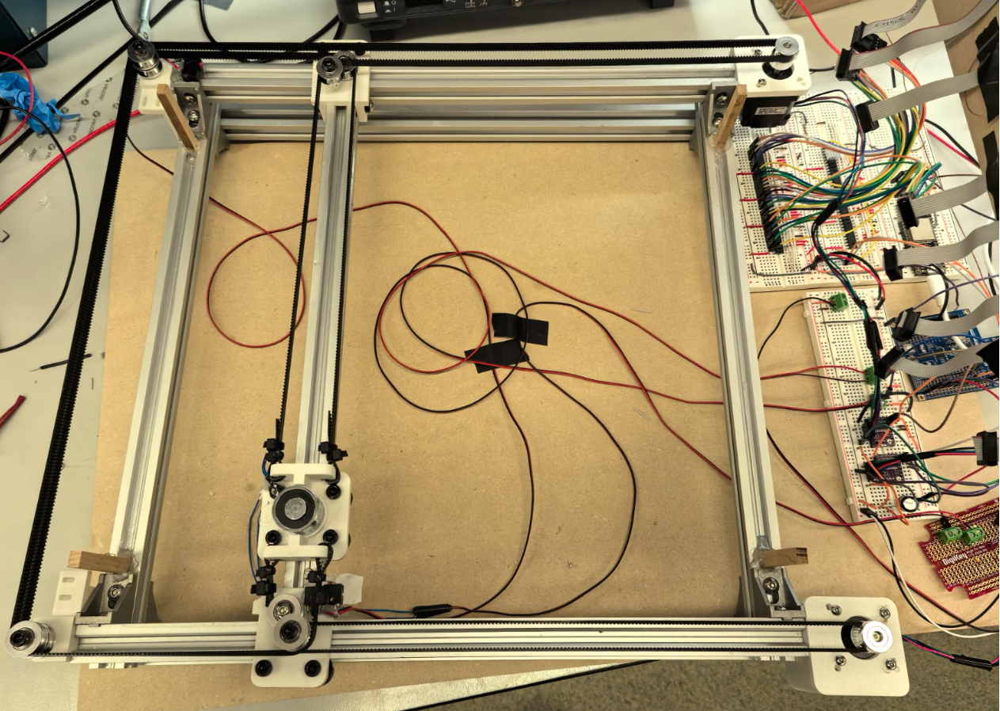
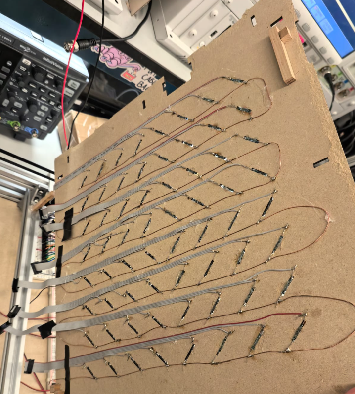
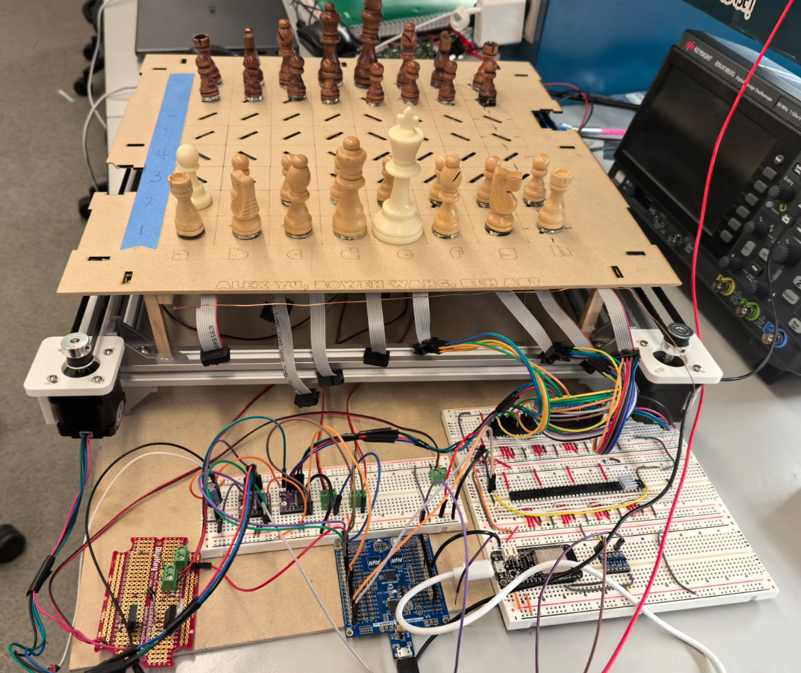
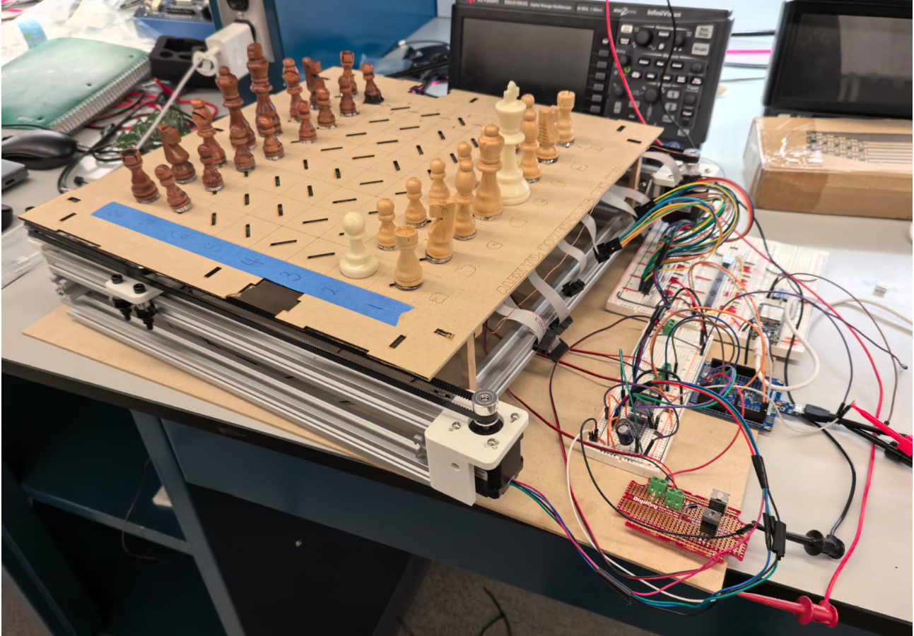
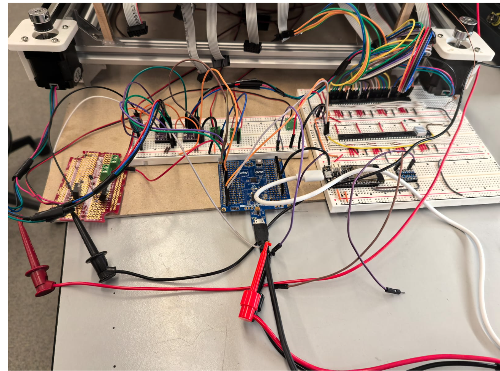
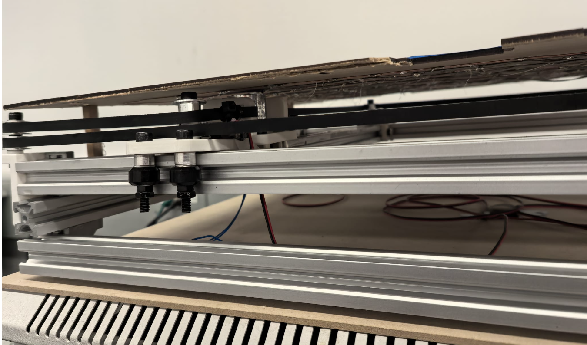

## Final Project Report

### 1. Video

### Demo Video

<iframe width="560" height="315" 
src="https://www.youtube.com/embed/V5qFEILboPI" 
title="YouTube video player" frameborder="0" 
allow="accelerometer; autoplay; clipboard-write; encrypted-media; gyroscope; picture-in-picture" 
allowfullscreen></iframe>

### 2. Images

<p align="center">
  
</p>

<table align="center" style="border-spacing:15px;">
  <tr>
    <td></td>
    <td></td>
    <td></td>
  </tr>
  <tr>
    <td></td>
    <td></td>
    <td></td>
  </tr>
</table>

### 3. Results

Game board scanning works on a firmware level, but physically, the magnets embeded in the chess pieces we had on hand were relativly weak and required accurate placement to close each reed switch. The game board integrated reed switches for each square, with careful attention to how they were installed to ensure that the electromagnet was able to get as close to the pieces as possible.

Scanning the state of each reed switch required 8 GPIO extenders using I2C communication with the Atmega328PB. To achive this, we wrote a custom two wire interface driver that Alex named I2C but has all the funciton calls as TWI.

We managed to write application code for the ESP32 to read JSON files downloaded from lichess.org corresponding to any user game. The ESP communicates with the ATmega over the Atmega's UART1.

When trying to create the code to connect with a online chess platfrom, we learned that chess.com does not have a publicly avaible API that allows for both game streaming and move uploading but the competitor site, lichess.org did.

So now, when the ESP32 turns on, it first tries to connect to wifi and then to the user account defined in [network-stuff](ESP32_lichess/network_stuff.h). It will then search for an active game, bot or human, and connect to it. If connected to a computer with the appropriate drivers, it will print out the progress to seral terminal.

In parallel, when the ATmega powers on, it initalizes all the GPIO expanders over I2C to set them up as data inputs with their internal pull up resistors on and in active low mode. It scans once for a inital board state and then enters the endless loop where it runs on the state machine described in sprint 2. When sending a move, it follows the following message format thats also described in the top comments of [lichess code](ESP32_lichess/ESP32_lichess.ino)

```c++
/*
  ESP32 Lichess Bridge - patched (castling payload + owner detection fixes)
  - Moves->ATmega formats:
    Normal:  <from><to>           e.g. e2e4
    Capture: <from><to><cap>      e.g. e5d6d5 (en-passant uses captured square)
    Castle:  <kfrom><kto><rfrom><rto>  e.g. e1g1h1f1 (8 chars)
  - Serial Monitor and Serial2 treated as ATmega-originated moves
  - Suppresses sending streamed moves that exactly match last ATmega-originated payload
  - Requires ArduinoJson (6.x)
*/
```

Upon the ESP32 recieving the move over UART1, the ESP32 will faithfully send the message of the moved piece to lichess.org and the website can on its own do legal move validation and sends back a status if it was successful or not.

The ESP32 does not oeprate on a strict sent move, wait for move, send move basis. It will send all messages from the ATmega that follow the format to lichess and send all lichess moves to the ATmega. The ESP32 does run application code to parse the JSON file that lichess uses to stream the game state with its API. This is unavoidable since sending the entire file over UART1 and having the ATmega also parse it would have taken way too much development time. The ESP32 parses the game log and sends the most recent moves to the ATMEGA only if the move does not match the last move the ATMEGA also sent.
When the ATMEGA recieves the recieves the move, it debug prints it to serial terminal over uart0 and parses the message to generate a list of commands for the motor control driver.

The gantry was successfully implemented and functioned as expected. All individual functionality worked, but the team had some issues during full integration. Our hypothesis for the root cause of the failure is discussed below. Given that full integration happened right before the final demo (components arrived super late), we are happy with how far we got and believe an extra day could get full functionality.

#### 3.1 Software Requirements Specification (SRS) Results

| ID     | Description                                                                                                                                                                    | Validation Outcome                                                                                                                             |
| ------ | ------------------------------------------------------------------------------------------------------------------------------------------------------------------------------ | ---------------------------------------------------------------------------------------------------------------------------------------------- |
| SRS-01 | The time between a move and the end of software computation will be within 2s.                                                                                                 | Latency between movment completion and ESP32 sending the move is under 2 seconds based on video evidence.                                      |
| SRS-02 | After playing multiple games, there should be zero instances where the incorrect piece is moved, the correct piece is moved to the wrong position, or no movement is captured. | No full games were played                                                                                                                      |
| SRS-03 | Upon a user pressing an e-stop, the system should stop moving within .5s                                                                                                       | No e-stop was implemented                                                                                                                      |
| SRS-04 | Signal disconnections should last for no more than 10s.                                                                                                                        | When the specified wifi network is not detected, it will continously search. When no game is detected, will seach 1/second until one is found. |
| SRS-05 | The system shall take no longer than 2 seconds to scan the game board.                                                                                                         | By meeting SRS-01 we meet SRS-05                                                                                                               |
| SRS-06 | The system shall differintiate between basic movment and capture.                                                                                                              | Achieved with the state machine, no existing video demonstration. Partially shown when proving SRS-06 with a basic movment                     |
| SRS-07 | The system shall achive 2 way communication over wifi with an online chess platform to facilitate games                                                                        | Demo video evidence also shows we meet SRS-07                                                                                                  |
| SRS-08 | The system shall ignore invalid messages sent to the ESP32                                                                                                                     | The ESP32 does ignore invalid messages and if an invalid move is send to lichess, it returns a invalid move error.                             |

No full games were ever played due to time constraints and supply chain issues. We never recieved our all electronic components and instead used whatever existed in Detkin Lab and recieved our reed switches within 3 hours of our scheduled final demo.
All listed requirements exceot 2 and 3 were met but some lack the photographic or video evidence at the time of writing. Requirement 2 had a extrememly high evaluation baseline which was to play multiple games. We did not complete building our game board.
3 was never implemented. All other requirements were necissary for the project to function as described in the proposal.

#### 3.2 Hardware Requirements Specification (HRS) Results

| ID     | Description                                                    | Validation Outcome                                                                                                                                                                        |
| ------ | -------------------------------------------------------------- | ----------------------------------------------------------------------------------------------------------------------------------------------------------------------------------------- |
| HRS-01 | The electromagnet must be operable through the chess board.    | Confirmed, the electromagnet can move to any cell of the chess board. Video shown in demo.                                                                                              |
| HRS-02 | No piece motion should take more than 10s.                     | The piece motion need about 20s, because the moving of electromagnet cannot be very fast, otherwise the piece cannot be held.                                                       |
| HRS-03 | The system shall exhibit a 2D gantry with taxi.                | Pass, video exhibited in demo.                                                                                                                                                            |
| HRS-04 | No piece should fall over at any instance                      | Pass, there were zero instances of pieces knocking over during transport. This was facilitated by ensuring the reed switches were installed correctly and not sticking through the board. |
| HRS-05 | Locational accuracy of the pieces must be within a 1mm radius. | We did not measure this, but after every move, the gantry was recalibrated to ensure the best accuracy. Further, the stepper motor is capabale of hitting this requirement.               |
| HRS-06 | No piece should collide with another piece when moving         | This could have been tested more, but code was implemented to ensure that the pieces traveled along the space between the other pieces on the board.                                      |
|        |                                                                |                                                                                                                                                                                           |

### 4. Conclusion

Reflect on your project. Some questions to address:

- What did you learn from it?

The difference from a product and a good product is more time, money, and a good supply chain. We believe if we had all of these, our project would be on another level.

- What went well?

The final sprint building the physical gantry, proto-prototypes, and software were relativly smooth. Overall individual functionality worked excellently.

- What accomplishments are you proud of?

Managing to write a custom I2C library for the 64 indevidual inputs was pretty cool. Also using the lichess.org API to play and stream the game online was a major breakthrough. Moving the pieces with the gantry through the board was also super exciting for us.

- What did you learn/gain from this experience?

Reading the datasheets for each electronic component found in Detkin that we needed to use was pretty new. Especially the MCP23008 GPIO expanders that were needed to write the I2C driver. Implementation with lichess was a new experience, and some team members had never worked with the components that we were utilizing.

- Did you have to change your approach / what could have been done differently?

Integrating skeleton code should have been done first. We failed to consider how components would communicate with each other beforehand and that slowed down integration considerably. I developed the message format between the ESP32 and ATmega after the MVP demo. We should have done so back in sprint 2 to define the descrete input/output of each software component. Development of the motor drivers was also slow. Parsing messages was simple but the fucntions used to control the motors with variable specific directions wasn't ready until the morning of the demo day. We should have also flagged the supply chain issue much earlier in the project, and maybe we could have gotten more support.

- Did you encounter obstacles that you didn’t anticipate?

Reed switches, the core pieces used to detect magnets were not delivered until 3 hours before our demo. We also had many issues with the laser cutters. 2/4 were not functional and hours were spent waiting to use them. The team had drafted expansions to the chess board for piece removal etc. but these could not be implemented due to the lack of functional lasers.

- What could be a next step for this project?

Fully inegrate gantry motor control with the rest of the software, finish building the board for a piece graveyard and to give an overall more finished look.

## References

https://www.instructables.com/Automated-Chessboard/

https://github.com/ese5160/a14-final-submission-group-chesstream?tab=readme-ov-file
